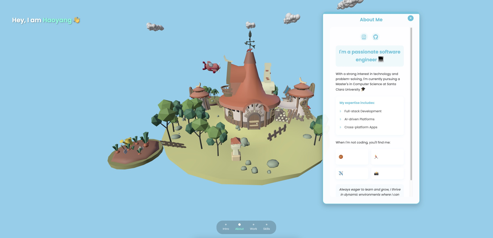

# 3D Portfolio 🌟



Welcome to my interactive 3D portfolio! ✨ Built with Three.js and modern web tech.

## ✨ Features

🏝️ Interactive 3D island environment
✈️ Animated aircraft with flight patterns
📱 Responsive design & touch controls
🎨 Modern UI with smooth animations

## 🛠️ Tech Stack

- Three.js
- GSAP
- HTML5/CSS3
- JavaScript

## 🚀 Getting Started

2. **Installation**
   ```bash
   # Clone the repository
   git clone https://github.com/yourusername/3d-portfolio.git

   # Navigate to project directory
   cd 3d-portfolio

   # Install dependencies
   npm install
   ```

3. **Development**
   ```bash
   # Start server
   npm run start

## Project Structure

```
3d_portfolio/
├── public/          # Static assets
│   └── models/      # 3D models
├── src/
│   ├── js/         # JavaScript files
│   ├── css/        # Stylesheets
│   └── assets/     # Other assets
├── index.html      # Entry point
└── package.json    # Project configuration
```

## 🎮 Controls

🖱️ **Desktop**
- Left Click + Drag: Rotate
- Right Click + Drag: Pan
- Scroll: Zoom

📱 **Mobile**
- One Finger: Rotate
- Two Fingers: Pan/Zoom

## 📄 License

This project is licensed under the MIT License - see the [LICENSE](LICENSE) file for details.
